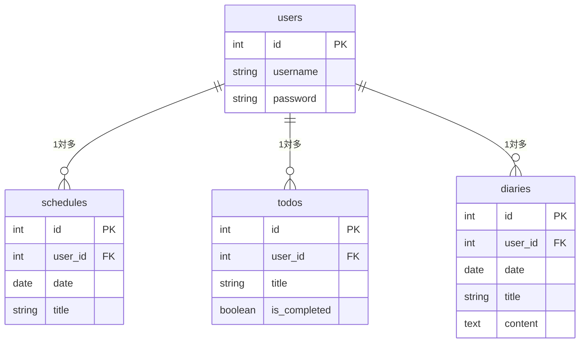
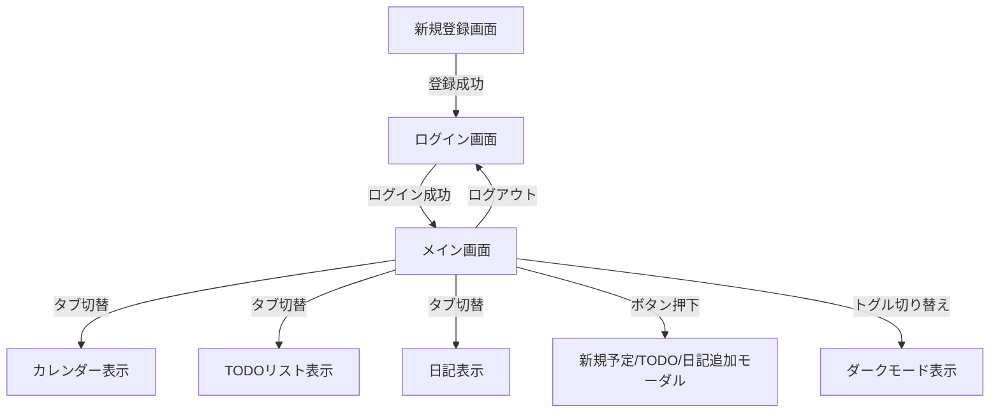
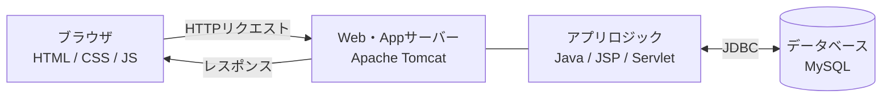

# MY PLANNER（スケジュール・TODOリスト・日記管理Webアプリ）

ログインユーザーごとに「カレンダー予定」「TODOリスト」「日記」を統合管理できるWebアプリケーションです。

---

## 💡 概要・目的

日常のタスクや予定、日記を1つの画面でストレスなく管理することを目的に作成しました。
画面を切り替えずに操作できるポップアップ画面（モーダル）や、サイドバーでのスムーズな画面表示切り替えにより、直感的な操作感を実現しています。

---

## ✨ 主な機能

- **ユーザー認証機能**
  - ログイン / ログアウト（セッション管理）
  - ログインユーザーごとのデータ表示切替

- **カレンダー・予定管理機能**
  - 月間カレンダー表示（前月/次月切替）
  - マス目クリックによる予定追加（ポップアップ表示）
  - 予定の削除機能（文字溢れ防止・スクロール表示対応）
  - 日記が存在する日のインジケーター（ドット）表示

- **TODOリスト機能**
  - タスクの追加 / 完了切り替え（打ち消し線表示）/ 削除
  - 非同期通信（Fetch API）による完了状態の即時更新

- **日記機能**
  - 日記の新規投稿（アコーディオン形式でのフォーム開閉）
  - 過去の日記一覧表示（改行保持表示対応）
  - 日記の編集 / 削除機能

- **UI / UX**
  - サイドバーによる画面表示切替（ホーム / カレンダー / TODO / 日記）
  - ダークモード / ライトモード切替（LocalStorageによる設定保存）

---

## 🛠 使用技術（技術スタック）

| カテゴリ | 技術・ライブラリ |
| :--- | :--- |
| **フロントエンド** | HTML5, CSS3, JavaScript (Vanilla JS) |
| **バックエンド** | Java 17 / JSP & Servlet |
| **データベース** | MySQL (または使用しているDB名) |
| **Webサーバー** | Apache Tomcat 10 |
| **ビルド/環境** | Eclipse / Git / GitHub |

---

## 🗄 データベース設計（ER構造）

### 1. `users` テーブル（ユーザー情報）
- `id` (INT, PK, AUTO_INCREMENT)
- `username` (VARCHAR)
- `password` (VARCHAR)

### 2. `schedules` テーブル（予定）
- `id` (INT, PK, AUTO_INCREMENT)
- `user_id` (INT, FK)
- `date` (DATE)
- `title` (VARCHAR)

### 3. `todos` テーブル（TODO）
- `id` (INT, PK, AUTO_INCREMENT)
- `user_id` (INT, FK)
- `title` (VARCHAR)
- `is_completed` (BOOLEAN)

### 4. `diaries` テーブル（日記）
- `id` (INT, PK, AUTO_INCREMENT)
- `user_id` (INT, FK)
- `date` (DATE)
- `title` (VARCHAR)
- `content` (TEXT)

---

## 📷 画面イメージ

### 新規登録画面

### ログイン画面

### メイン画面

### カレンダー

### TODOリスト

### 日記

### ダークモード使用例

---

## 📊 ER図

---

## 🔄 画面遷移図

---

## 🏗 システム構成図

